<picture>
  <source media="(prefers-color-scheme: dark)" srcset="./dark.svg">
  <source media="(prefers-color-scheme: light)" srcset="./light.svg">
  
</picture>

  

  
  
  
  

---

### 🛡️ About Me

> **3rd Year B.Tech Cybersecurity Student · AI & Threat Detection Practitioner**
>
> I operate at the intersection of **cybersecurity and artificial intelligence**, engineering solutions that bridge offensive security analysis and intelligent defense. My technical journey spans training deep neural networks for network anomaly detection, participating in CTFs and penetration testing, and engineering resilient, secure full-stack applications.

* 🔐 **Offensive & Defensive Security:** Hands-on exploration in network penetration testing, vulnerability assessment, CTF competitions, and bug bounty hunting.
* 🤖 **Applied Machine Learning:** Developing threat detection pipelines, anomaly identification models, and computer vision algorithms using TensorFlow and OpenCV.
* 💻 **Software Engineering:** Building full-stack web applications with modern architectures, clean code practices, and zero-trust security principles.
* 💡 **Core Mindset:** *"Clean code, proactive defense, and continuous adaptation across the cyber threat landscape."*

---

### 🧰 Technical Arsenal

#### **🔐 Cybersecurity & Offensive Tooling**

  
  
  
  
  
  
  

#### **🤖 Artificial Intelligence & Data Science**

  
  
  
  
  
  

#### **🌐 Web Development & Databases**

  

---

### 📊 GitHub Activity & Telemetry

  
  

  

---

### ⚡ Ongoing Pursuits

- 🎯 **CTFs & Bug Hunting:** Sharpening practical exploit mitigation, web security analysis, and binary exploitation skills.
- 🧠 **AI-Assisted Threat Intelligence:** Researching automated network intrusion classification using deep learning architectures.
- 🚀 **Full-Stack Security:** Engineering web platforms adhering to OWASP Top 10 guidelines and modern auth standards.
- 🤝 **Open Source:** Enthusiastic about contributing to security tooling and intelligent automation projects.

---

### 📬 Connect & Collaborate

I'm always open to discussing cybersecurity research, AI threat modeling, CTF challenges, or collaborating on innovative technical projects.

  <a href="https://linkedin.com/in/vagish-n-kora-459149212"><b>LinkedIn</b></a> · 
  <a href="https://github.com/vagishkora"><b>GitHub</b></a> · 
  <a href="https://x.com/vagishkora2003"><b>X / Twitter</b></a> · 
  <a href="https://instagram.com/vagish__k"><b>Instagram</b></a>
    
  Designed with precision &amp; zero-trust principles.

